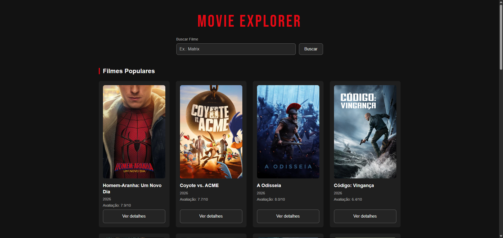
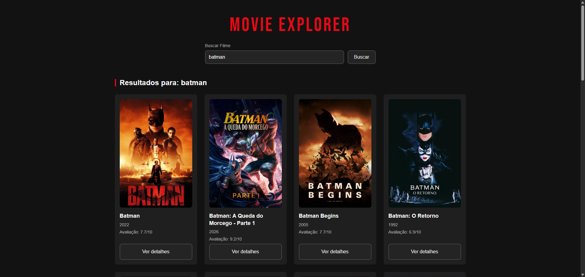
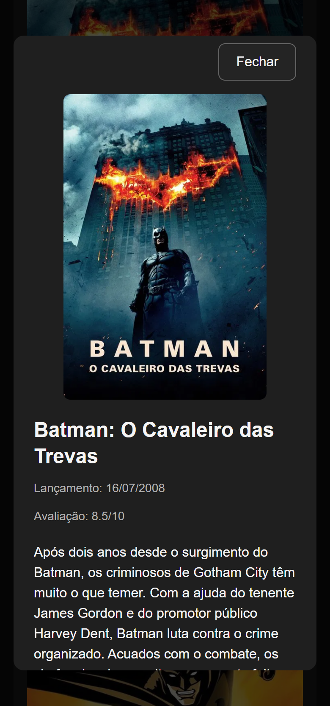

# Movie Explorer

Aplicação web para explorar filmes utilizando dados da API do TMDB. O projeto permite visualizar filmes populares, pesquisar por título e consultar informações detalhadas de cada filme.

Desenvolvido com **JavaScript Vanilla**, com foco na prática de consumo de APIs, programação assíncrona, manipulação do DOM, tratamento de estados e integração entre front-end e uma função serverless.

## Demonstração

🔗 [Acessar o Movie Explorer](https://italo-movie-explorer.vercel.app/)

## Preview

### Filmes populares



### Busca de filmes



### Detalhes do filme — Mobile

<p align="center">
  
</p>

## Funcionalidades

- Exibição de filmes populares ao carregar a aplicação
- Pesquisa de filmes por título
- Exibição de pôster, título, ano e avaliação
- Modal com informações detalhadas de cada filme
- Exibição de data de lançamento, avaliação e sinopse
- Estados de carregamento, erro e nenhum resultado
- Interface responsiva para desktop e dispositivos móveis
- Integração com a API do TMDB
- Token da API protegido por uma função serverless

## Tecnologias

- HTML5
- CSS3
- JavaScript (ES6+)
- Fetch API
- TMDB API
- Vercel Serverless Functions
- Git e GitHub

## Arquitetura

O front-end não acessa diretamente a API do TMDB utilizando as credenciais.

As requisições são feitas para uma função serverless hospedada na Vercel, responsável por se comunicar com a API do TMDB.

```text
Front-end
    │
    ▼
/api/movies
    │
    ▼
Vercel Serverless Function
    │
    ▼
TMDB API
```

O token de acesso à TMDB é armazenado como uma **variável de ambiente no servidor**, evitando sua exposição no código executado pelo navegador.

A função serverless é responsável pelas três principais operações da aplicação:

```text
/api/movies
→ Filmes populares

/api/movies?query=Batman
→ Pesquisa por título

/api/movies?id=603
→ Detalhes de um filme
```

## Estrutura do projeto

```text
movie-explorer/
├── api/
│   └── movies.js
├── assets/
│   └── images/
├── css/
│   └── style.css
├── js/
│   ├── api.js
│   ├── main.js
│   ├── state.js
│   └── ui.js
├── index.html
├── .gitignore
└── README.md
```

## Principais aprendizados

Durante o desenvolvimento deste projeto, pratiquei conceitos como:

- Consumo de APIs REST
- `fetch`, `async` e `await`
- Tratamento de erros HTTP e falhas de rede
- Manipulação e renderização dinâmica do DOM
- Separação de responsabilidades com módulos JavaScript
- Gerenciamento de estados da interface
- Query parameters e `URLSearchParams`
- Uso de variáveis de ambiente
- Criação de funções serverless
- Separação entre código executado no navegador e no servidor
- Proteção de credenciais de APIs
- Deploy utilizando Vercel

## API

Os dados dos filmes são fornecidos pela [The Movie Database (TMDB)](https://www.themoviedb.org/).

Este produto utiliza a API do TMDB, mas não é endossado ou certificado pelo TMDB.

## Autor

Desenvolvido por **Ítalo Martins**.

[GitHub](https://github.com/italomartinsg)
